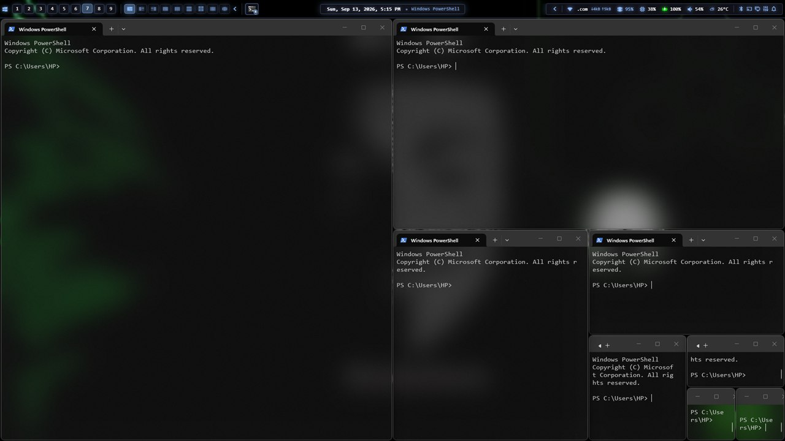
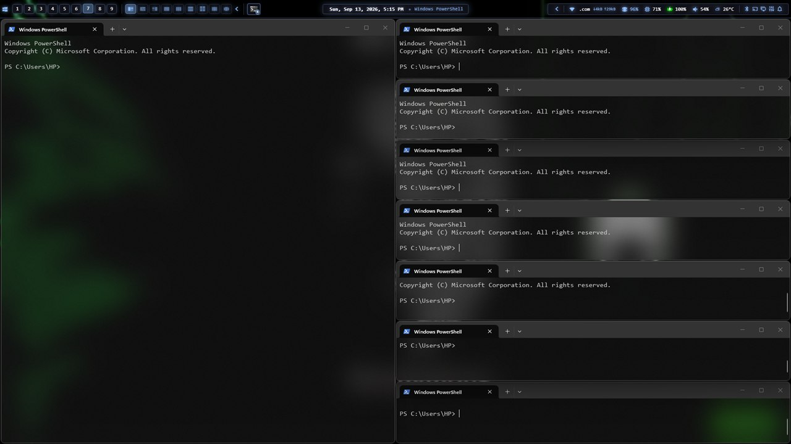
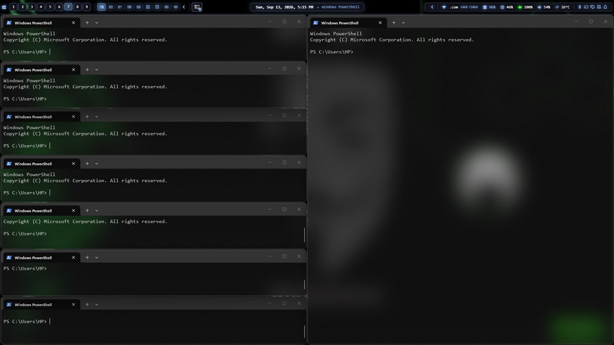
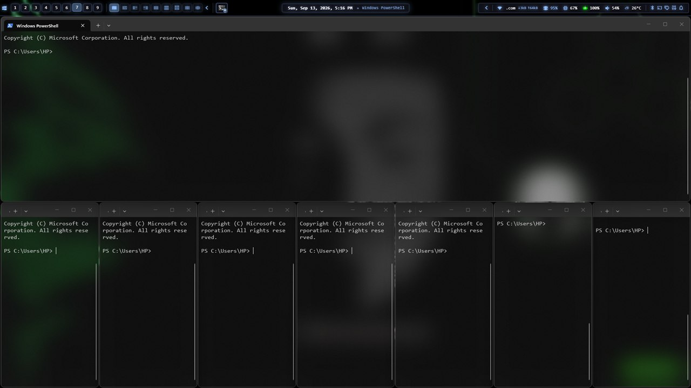
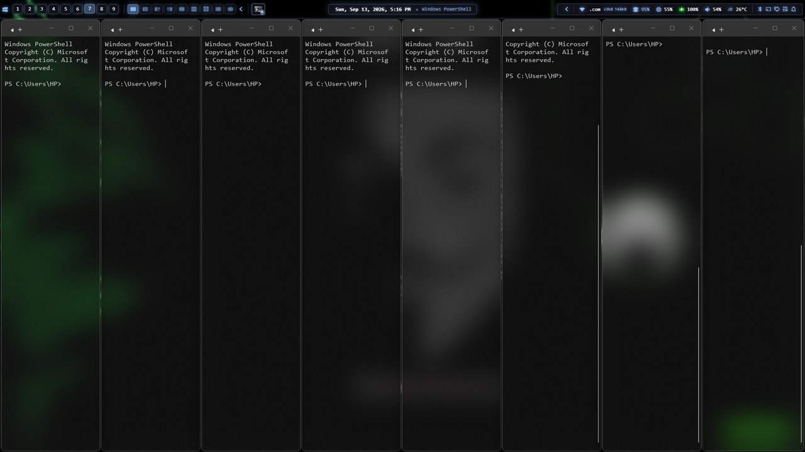
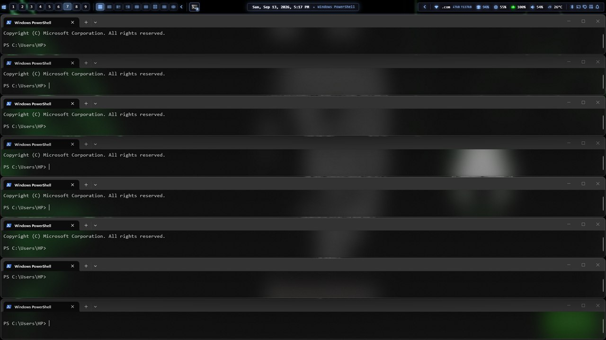
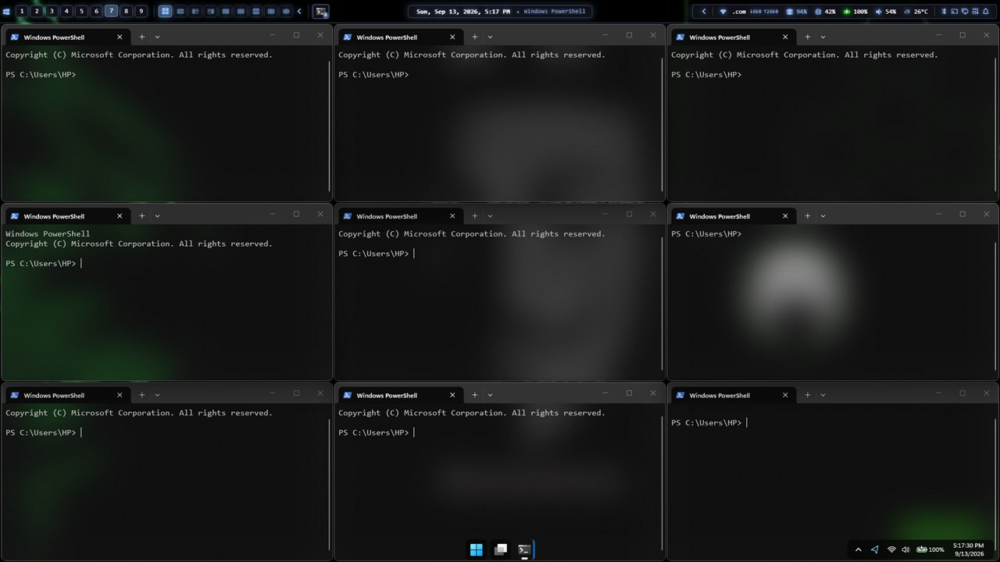
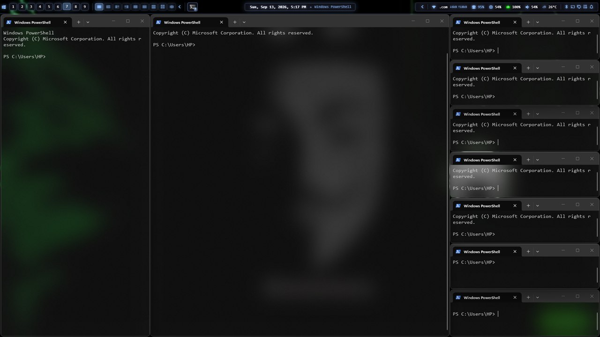

# komorebi · Midnight Eclipse preset

A keyboard-first [komorebi](https://github.com/LGUG2Z/komorebi) setup for Windows 11: tight 2px gaps, a soft blue focus border, nine workspaces, and Alt-based keybindings that leave Windows' own Win-key shortcuts alone.

It's the window-manager half of **Midnight Eclipse**: it reserves the top 44px for the **[Midnight Eclipse Zebar bar](https://github.com/S0wet0/midnight-eclipse)** and uses the bar's accent colour for the focus border.

 It works without the bar too; see [Using it without the bar](#using-it-without-the-bar).

## Requirements

- Windows 11
- komorebi 0.1.41 or later and whkd: `winget install LGUG2Z.komorebi` and `winget install LGUG2Z.whkd`
- Windows Terminal, for Alt+Enter

## Install

```powershell
git clone https://github.com/S0wet0/komorebi-midnight-eclipse.git
cd komorebi-midnight-eclipse
powershell -NoProfile -ExecutionPolicy Bypass -File .\install.ps1
komorebic start --whkd
```

`install.ps1` copies `komorebi.json` to `%USERPROFILE%` and `whkdrc` to `%USERPROFILE%\.config` (or `KOMOREBI_CONFIG_HOME` / `WHKD_CONFIG_HOME` if you've set them), backing up any existing files as `*.bak-<timestamp>`, and downloads komorebi's community app rules (`applications.json`). It doesn't need admin rights and doesn't start anything.

To start komorebi automatically at logon, and to tile and control admin windows, see [Autostart](#autostart-optional-elevated).

## Keybindings

Alt is the window-manager key. Win keeps Windows' meanings (Win+D, Win+E, Win+L, Win+Tab, and Win+1…9 for taskbar apps).

| Keys | Action |
|---|---|
| **Alt + H / J / K / L** or **Alt + arrows** | Focus the window left / down / up / right |
| **Alt + Shift + H / J / K / L** or **arrows** | Move the focused window |
| **Alt + U / P** | Narrower / wider |
| **Alt + I / O** | Shorter / taller |
| **Alt + V** | Cycle layouts |
| **Alt + Ctrl + H / J / K / L** or **arrows** | Choose where the next window opens (BSP) |
| **Alt + Ctrl + C** | Cancel that choice |
| **Alt + T** | Toggle floating |
| **Alt + F** | Monocle: the focused window fills the work area (the bar stays visible) |
| **Alt + Shift + F** | Maximize: the whole screen, bar included |
| **Alt + M** | Minimize |
| **Alt + Shift + Q** | Close the window |
| **Alt + 1…9** | Go to workspace 1…9 |
| **Alt + Shift + 1…9** | Move the window to workspace 1…9 (focus follows) |
| **Alt + S / A** | Next / previous workspace |
| **Alt + D** | Back to the last workspace |
| **Alt + Enter** | New Windows Terminal window |
| **Alt + Shift + P** | Pause / resume tiling |
| **Alt + Shift + R** | Reload the config |
| **Alt + Shift + W** | Retile |
| **Alt + Shift + E** | Stop komorebi |

Alt + R and Alt + Shift + Space are left free on purpose.

## Layouts

Each workspace has its own layout. **Alt + V** cycles through them, and the [Midnight Eclipse bar](https://github.com/S0wet0/midnight-eclipse)'s layout drawer picks one directly. Every workspace starts in BSP.

| BSP | Vertical Stack |
|---|---|
|  |  |
| Each new window splits the focused one in half, alternating direction, so windows spiral inwards. | One main window on the left; the rest stack on the right. |

| Right Main Vertical Stack | Horizontal Stack |
|---|---|
|  |  |
| The mirror image: main window on the right, the stack on the left. | One main window across the top; the rest side by side underneath. |

| Columns | Rows |
|---|---|
|  |  |
| Every window gets a full-height column of equal width. | Every window gets a full-width row of equal height. |

| Grid | Ultrawide Vertical Stack |
|---|---|
|  |  |
| Windows fill an even grid. | Main window in the centre, one column on the left, the rest stacked on the right. Made for wide screens. |

**Scrolling** is the ninth: windows sit side by side in columns, only a few fit on screen at once, and the view scrolls sideways as focus moves.

## What the config does

- **2px gaps everywhere.** komorebi insets each window by its container padding plus the border's width and offset. Here that's 0 + (2 − 1) = 1px per window, so neighbouring windows are 2px apart. The 1px workspace padding plus that 1px inset gives 2px at the screen edges too.
- **Focus border**: 2px, rounded, `#8DBCFF`, for single windows, stacks and monocle alike.
- **Room for a 44px bar at the top.** In `global_work_area_offset`, `right` and `bottom` are the *width and height reduction*, not edge offsets. So a top bar needs `top: 44` **and** `bottom: 44`; with `bottom: 0` the work area would extend 44px below the screen.
- **Nine tiling workspaces** on one monitor, named 1–9.
- **Cloak** hides windows on other workspaces (the default, and the most reliable option for Electron apps). **Mouse follows focus** moves the pointer to keyboard-focused windows.
- **Floating windows** open centred; toggling float centres and resizes.
- **Rules:**
  - Zebar is never tiled.
  - Input-method (IME) helper windows, picture-in-picture players, the PowerToys Command Palette and Lively Wallpaper are ignored.
  - Office dialogs are ignored, while the main Excel, Word and PowerPoint windows are still tiled.
  - The Claude desktop app is force-managed: it draws its own frame, which komorebi would otherwise skip. It's matched on exe, window class *and* title together, because matching on the exe alone also caught its hidden IME window. Use it as a template for other frameless apps.

## Autostart (optional, elevated)

`autostart\install.ps1` (run from an **Administrator** PowerShell) sets komorebi, whkd and Zebar to start at logon and restart after a crash:

```powershell
powershell -NoProfile -ExecutionPolicy Bypass -File .\autostart\install.ps1
```

The tasks are set up for the account signed in to the desktop, even if you elevate with a different administrator's password; pass `-User DOMAIN\name` to choose another. On a standard (non-admin) account there's no elevation to use, so komorebi and whkd run at normal privilege and admin windows won't be tiled.

It registers two scheduled tasks under `\komorebi-desktop\`:

| Task | Runs | Why |
|---|---|---|
| `Elevated` | komorebi and whkd, **as administrator** | A normal komorebi can't see or tile elevated windows (admin terminals, some installers and tools), and a normal whkd can't catch keys pressed while one is focused. |
| `User` | Zebar, at normal privilege, once komorebi is answering | A bar that starts before komorebi gets tiled like a window. Zebar is restarted whenever komorebi restarts, so its connection recovers. Skipped if Zebar isn't installed. |

Each task runs a small supervisor script that restarts its programs after a crash (but not after a deliberate Alt + Shift + E), with a brake of 5 restarts per 5 minutes. Before each start it deletes komorebi's saved window-state snapshot, because komorebi restores that snapshot without re-checking window rules.

**Security, since this runs elevated:**
- whkd runs whatever `whkdrc` says, as administrator. So the installer copies `whkdrc` and the supervisor scripts to `C:\ProgramData\komorebi-desktop`, which only administrators can change, and the elevated whkd reads it from there. Re-run the installer after editing `whkdrc`.
- whkd starts PowerShell without `-NoProfile`, so your PowerShell profile also runs elevated whenever a binding fires.
- The elevated komorebi reads `komorebi.json` from your profile. It's window rules and layout settings, with no field known to run commands.
- Anything whkd launches directly runs elevated. That's why Alt + Enter opens Windows Terminal through Explorer, which starts it as your normal user.

If you'd rather not run anything elevated, skip autostart and start komorebi yourself with `komorebic start --whkd`; admin windows just won't be tiled.

Logs are in `C:\ProgramData\komorebi-desktop\logs\elevated.log` and `%LOCALAPPDATA%\komorebi-desktop\logs\user.log`. To remove the autostart, run `autostart\uninstall.ps1` as administrator (add `-RemoveFiles` to also delete the ProgramData folder).

If the Midnight Eclipse theme is installed, the autostart takes over starting Zebar and removes the theme's own logon entry, so Zebar isn't launched twice. The uninstaller gives that entry back, so the bar keeps starting at logon without the preset.

The supervisors expect the default install locations: `C:\Program Files\komorebi\bin`, `C:\Program Files\whkd\bin` and `C:\Program Files\glzr.io\Zebar`. If yours differ, edit the paths at the top of `autostart\start-elevated.ps1` and `autostart\start-user.ps1` before installing.

## Using it without the bar

Set `global_work_area_offset` to all zeros in `komorebi.json`, or to whatever your own bar needs, and remove the `zebar.exe` ignore rule if you don't use Zebar.

## Tips

- **Rules not taking effect after an edit?** komorebi may have restored its saved window state. Delete `%LOCALAPPDATA%\Temp\komorebi.state.json` and restart komorebi; autostart does this automatically.
- **Exe names need `.exe`**, and matching is case-sensitive unless you use a regex like `(?i)^app\.exe$`.
- An app in its **own fullscreen mode** (F11) covers the bar and ignores tiling. That's the app, not komorebi; press F11 again.
- **Optional:** turning off Windows' Snap (Settings → System → Multitasking → Snap windows) stops Win + arrows from fighting the tiling.

## License

[MIT](LICENSE) © 2026 S0wet0
